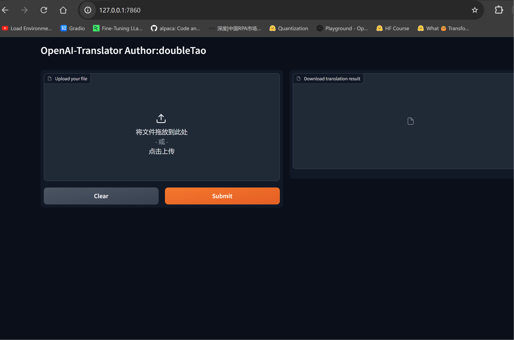
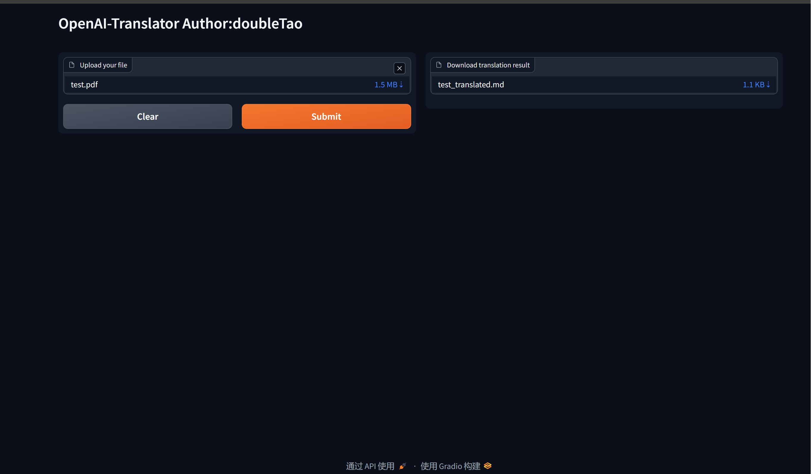

作业1：支持图形用户界面（GUI），提升易用性。
使用gradio增加GUI界面，并调整了输出使得翻译结果以markdown格式直接下载
新增：https://github.com/doubleTaoTao/openai-quickstart-doubleTao/blob/main/openai-translator/ai_translator/gradio_demo.py
修改：
openai-translator/ai_translator/translator/pdf_translator.py
openai-translator/ai_translator/translator/writer.py

